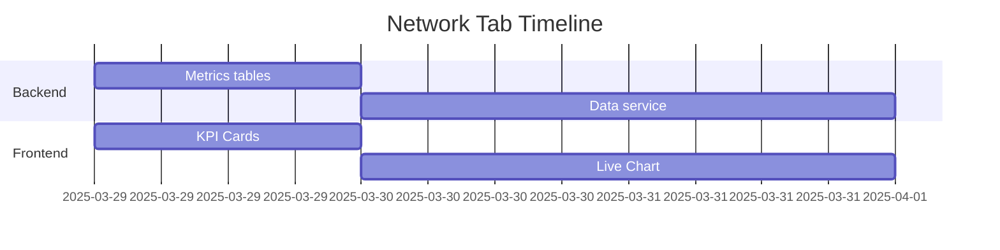

# Admin Portal Features Implementation Plan

## Network Tab Features
1. **Live Updating Line Chart**
   - Real-time network metrics visualization
   - Custom time range selection
   - Threshold markers for alerts

2. **Dashboard with KPI Cards**
   - Uptime percentage
   - Latency metrics
   - Throughput monitoring
   - Packet loss indicators

3. **Implementation Timeline**:


## Users Tab Features
1. **User Types**:
   - Students
   - Instructors
   - Admins

2. **Implementation Details**:
   - Supabase storage for user data
   - Role-based access control
   - Realtime updates to frontend

3. **Database Schema**:
```sql
CREATE TABLE user_roles (
  id UUID PRIMARY KEY,
  user_id UUID REFERENCES users(id),
  role VARCHAR(20) CHECK (role IN ('student', 'instructor', 'admin')),
  assigned_at TIMESTAMPTZ NOT NULL DEFAULT NOW()
);
```

## Reports Tab Features
1. **Core Functionality**:
   - Pre-built analytics reports
   - Custom report builder
   - Multiple export formats (PDF, Excel, CSV)

2. **Technical Components**:
   - Report templates system
   - Scheduling engine
   - Export endpoints
