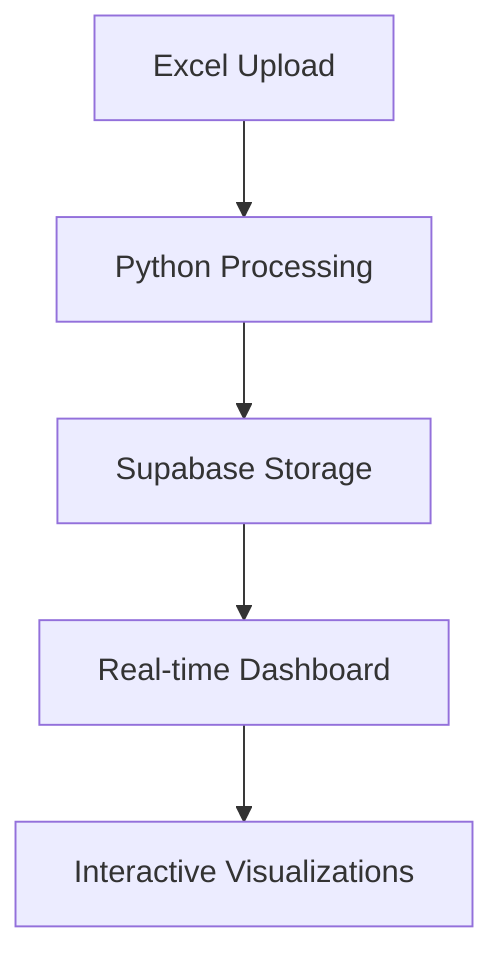

# Analytics Dashboard Fix Plan (Updated)

## Key Improvements
1. Remove SupabaseTest component
2. Replace dummy data with real processed data
3. Implement premium chart visualizations
4. Connect file upload to Python processing

## Data Processing Flow

## Implementation Checklist
- [ ] Remove test components
- [ ] Set up Python processing endpoints
- [ ] Configure Supabase real-time
- [ ] Implement ApexCharts integration
- [ ] Connect file upload pipeline
- [ ] Add error handling
- [ ] Optimize performance
