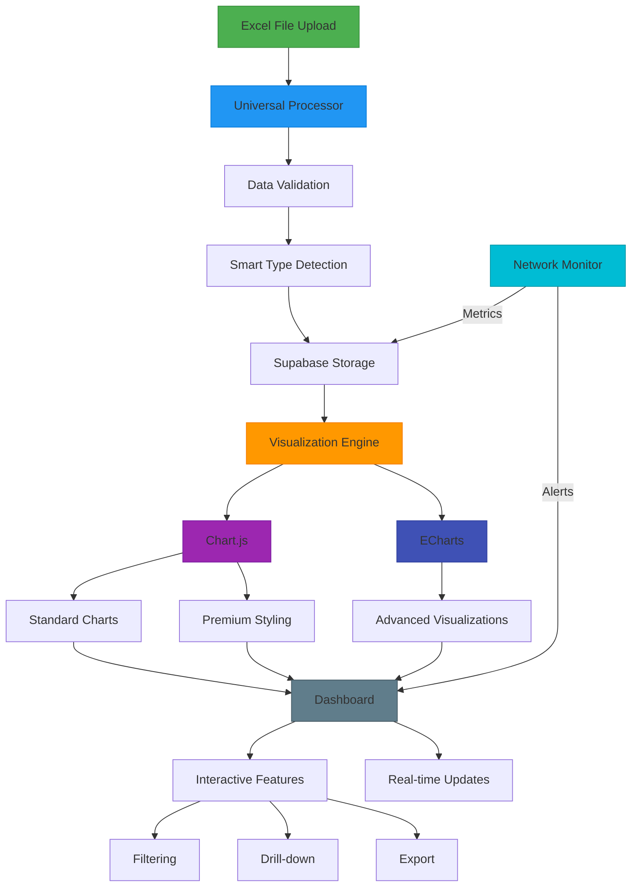

# System Architecture (Updated 2025-03-27)

## Key Components:
1. **Data Processing Pipeline** (Green/Blue)
   - Universal Excel file handling
   - Dynamic schema detection
   - Smart data type inference

2. **Visualization Layer** (Purple/Blue)
   - Chart.js for core premium charts
   - ECharts for advanced visualizations
   - Shared state management

3. **Dashboard Features** (Gray)
   - Interactive filtering
   - Drill-down analytics
   - Multi-format exports
   - Real-time updates
